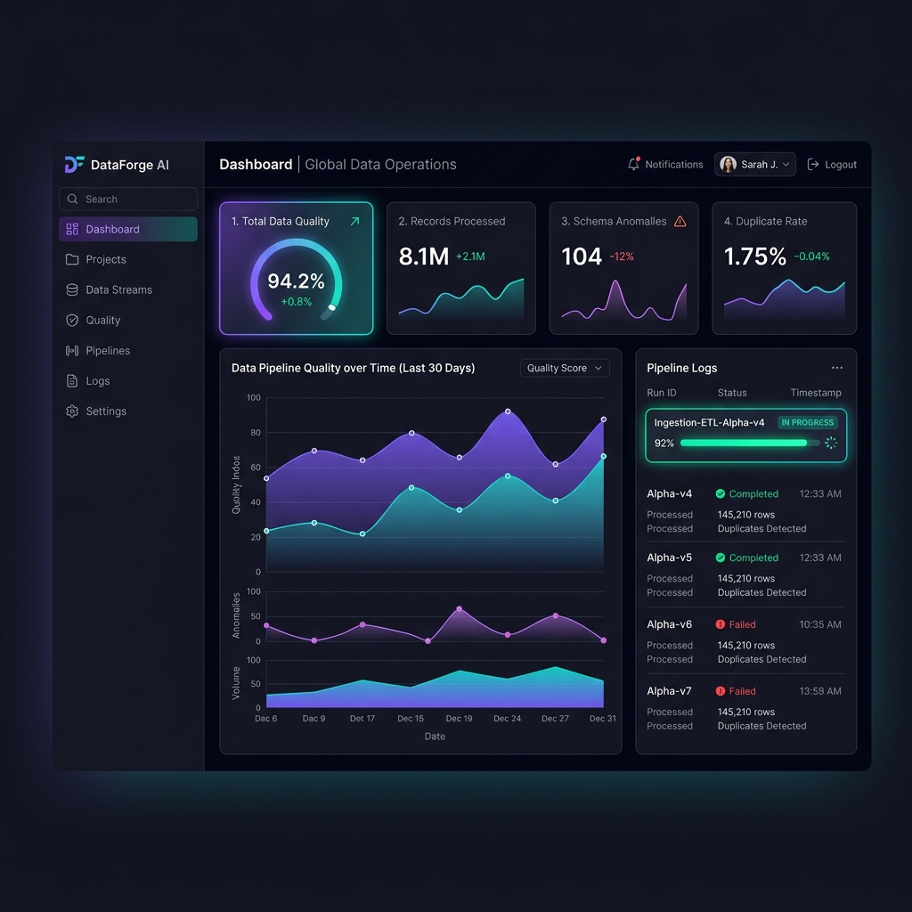
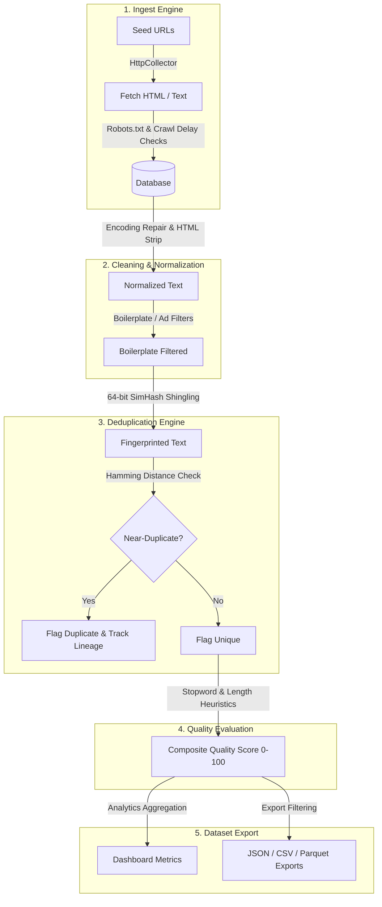

# DataForge AI

[](https://github.com/BradRobin/DataForge-AI/actions/workflows/ci.yml)
[](LICENSE)
[](pyproject.toml)

**DataForge AI** is a production-grade, high-throughput AI Data Engineering Pipeline designed to ingest, clean, normalize, deduplicate, score, analyze, and export massive text datasets suitable for training and evaluation of Large Language Models (LLMs) and other machine learning systems.

Equipped with both a robust, modular **FastAPI** backend and a premium **Next.js** dashboard interface, DataForge AI provides developer-friendly tools to scale text extraction tasks while maintaining clean database integrity and quality heuristics.

---

## 🎨 Interactive Client Workspace

DataForge AI features a responsive glassmorphism dark-theme single-page dashboard for pipeline management and data exploration:



---

## 🏗️ Project Architecture & Data Flow

DataForge AI operates as a sequential staging pipeline. Data travels through five core engine layers, persisting metadata flags and metrics at each phase:



---

## 🛠️ Feature Breakdown

1.  **Extensible Ingestion**: Dynamic crawler plugin interface. The default `HttpCollector` asynchronously crawls web pages, automatically caching and complying with `robots.txt` rules and respecting crawl-delays.
2.  **Boilerplate Cleaning**: Fixes double-encoded UTF-8 text (Latin-1 conversion), strips nested HTML tags (along with `<script>`, `<style>`, and `<nav>`), standardizes smart punctuation, and filters cookie banners, navigation sidebars, and ads.
3.  **Hamming Deduplication**: Identifies near-duplicates by shingling character 3-grams to construct a 64-bit SimHash fingerprint, storing lineage links pointing to parent records.
4.  **Quality Heuristics**: Evaluates text against six weighted dimensions—length, stop-word frequency, readability index, noise ratio, word repetition, and malformed markers—producing a composite quality score from 0 to 100.
5.  **Analytics Compilation**: Aggregate counts, word/char counts, source/language distributions, quality bucket counts, and top keywords.
6.  **Dataset Export**: Supports Parquet, JSON, and CSV exports filtered by language, source, minimum quality score, and duplicate exclusions.
7.  **One-Click Pipeline**: Sequentially executes the full pipeline from seed URLs to Parquet export package with real-time logs and cancel triggers.

---

## 🔌 API Reference & Documentation

Detailed interactive Swagger API documentation is available at `http://localhost:8000/docs` when the backend is running. Below is a summary of the core endpoints:

### Ingest & Collection Engine
*   `POST /api/v1/ingest/trigger` — Trigger a new background web crawler job.
    *   *Request Payload:* `{"urls": ["url1", "url2"], "retries": 3}`
    *   *Response Payload:* `{"job_id": "uuid-string"}`
*   `GET /api/v1/ingest/status/{job_id}` — Query the progress, status, and collected counts of a crawl job.

### Data Cleaning & Normalization
*   `POST /api/v1/clean/text` — Preview normalization transformations in a sandbox environment (no DB side effects).
*   `POST /api/v1/clean/{document_id}` — Clean a specific document in the database by its UUID.
*   `POST /api/v1/clean/batch/run` — Batch clean all uncleaned database documents (optional limit parameters).

### Deduplication Engine
*   `POST /api/v1/dedup/run` — Run SimHash deduplication on all cleaned, undeduplicated documents.
    *   *Request Payload:* `{"threshold": 12}`
*   `GET /api/v1/dedup/stats` — Retrieve overall exact and near-duplicate counts.

### Quality Scoring Heuristics
*   `POST /api/v1/quality/text` — Score a text fragment inside the testing sandbox.
*   `POST /api/v1/quality/{document_id}` — Evaluate and grade a specific database document.
*   `POST /api/v1/quality/batch/run` — Batch grade all ungraded documents.

### Analytics Compilation
*   `GET /api/v1/analytics/overview` — Compile and return dashboard metrics.

### Dataset Export
*   `GET /api/v1/export/export` — Download filtered database records.
    *   *Query Parameters:* `format_type` (json/csv/parquet), `source`, `language`, `min_quality`, `exclude_duplicates`.

### One-Click Pipeline Orchestrator
*   `POST /api/v1/pipeline/run` — Trigger the full sequential execution pipeline.
    *   *Request Payload:* `{"urls": ["url1"], "threshold": 12, "export_format": "parquet"}`
    *   *Response:* `{"pipeline_id": "uuid-string"}`
*   `GET /api/v1/pipeline/status/{pipeline_id}` — Monitor executing stage and progress.
*   `POST /api/v1/pipeline/cancel/{pipeline_id}` — Halt execution immediately.
*   `GET /api/v1/pipeline/download/{pipeline_id}` — Retrieve the final cached export package.

---

## 🐋 Docker Compose Quick Start (Recommended)

DataForge AI is fully containerized. To spin up the database (PostgreSQL), backend server, and Next.js client from scratch:

1.  Clone this repository.
2.  Create your local environment settings:
    ```bash
    cp .env.example .env
    ```
3.  Launch the services:
    ```bash
    docker compose up --build
    ```
4.  Access the applications:
    *   Next.js Client: `http://localhost:3000`
    *   FastAPI Swagger UI: `http://localhost:8000/docs`

---

## 💻 Local Development Setup (Without Docker)

If you are running the project locally without Docker, the backend dynamically falls back to an SQLite database file (`./dataforge.db`) automatically if a PostgreSQL server is not available.

### 🚀 Automated Dev Init Script
To run both backend and frontend development servers concurrently in named Windows consoles:
```powershell
./run_dev.ps1
```

### Manual Configuration

#### 1. Configure Backend:
1.  Navigate to the `backend/` directory.
2.  Install dependencies using Poetry:
    ```bash
    poetry install
    ```
3.  Perform database migrations:
    ```bash
    poetry run alembic upgrade head
    ```
4.  Start development server:
    ```bash
    poetry run uvicorn app.main:app --reload --host 127.0.0.1 --port 8000
    ```

#### 2. Configure Frontend:
1.  Navigate to the `frontend/` directory.
2.  Install packages:
    ```bash
    npm install
    ```
3.  Start Next.js server:
    ```bash
    npm run dev
    ```

---

## 🧪 Testing & Verification

We use `pytest` for backend unit and integration testing. Tests utilize an isolated in-memory SQLite database (`sqlite+aiosqlite:///:memory:`) to ensure speed and independence.

Run the test suite:
```bash
cd backend
poetry run pytest
```

Validate frontend static compilation:
```bash
cd frontend
npm run build
```

---

## ⚖️ Ethical Considerations & Data Provenance

1.  **Crawler Politeness & Compliance**: The `HttpCollector` strictly adheres to `robots.txt` exclusions. It parses directive policies, respects crawl-delays, and limits request frequencies to prevent server overload.
2.  **Dataset Licensing**: DataForge AI tags document metadata with the origin source URL. Users are advised to review the data licenses of their target seed domains to ensure compliance with copyright and fair-use guidelines.
3.  **PII Filtering**: When pipeline data is clean and processed, developers are encouraged to add custom regex filters to strip Personally Identifiable Information (PII) such as email addresses and phone numbers.
4.  **Consent and Exclusions**: Scraping parameters support domain exclusion lists to prevent processing sensitive or private platforms.

---

## 🗺️ Future Roadmap

*   **Semantic Deduplication**: Transition from token-based SimHash to vector embeddings and vector similarity lookups (using Milvus or pgvector) to catch deeper semantic duplicates.
*   **LLM-based Quality Filters**: Integrate lightweight models (like Llama-3-8B-Instruct or GPT-4o-mini) to grade semantic coherence and context truthfulness.
*   **Horizontal Scalability**: Migrate background asyncio tasks to Celery workers backed by a Redis/RabbitMQ message queue to orchestrate massive scraping sweeps across distributed instances.

---

## 📄 License

Distributed under the MIT License. See [LICENSE](LICENSE) for more details.
